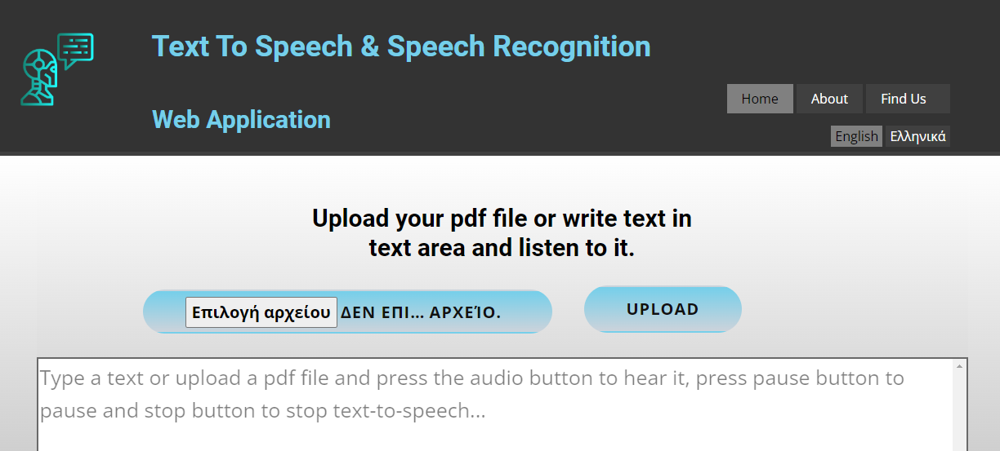
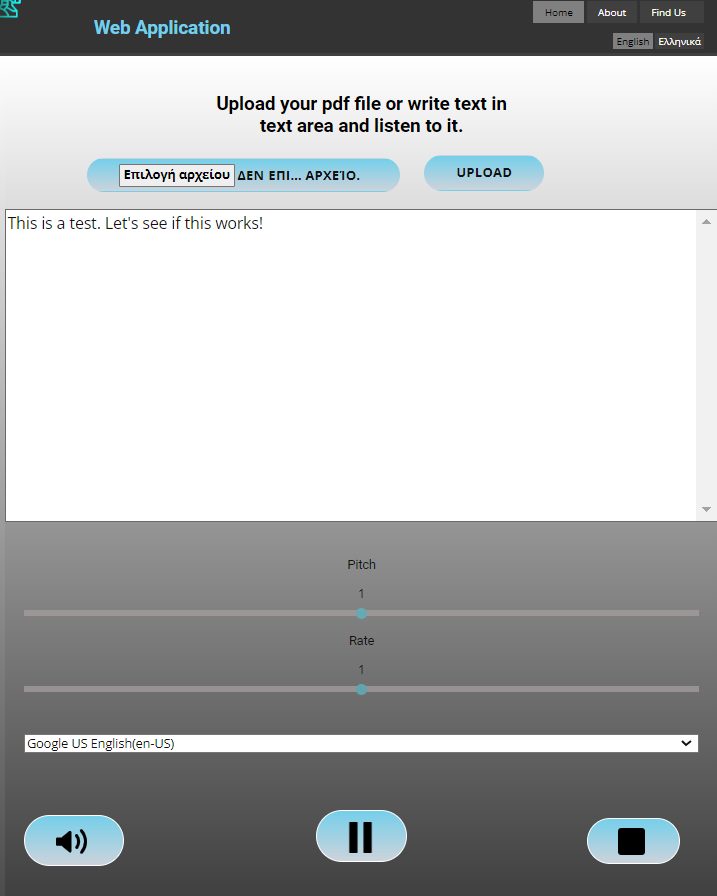
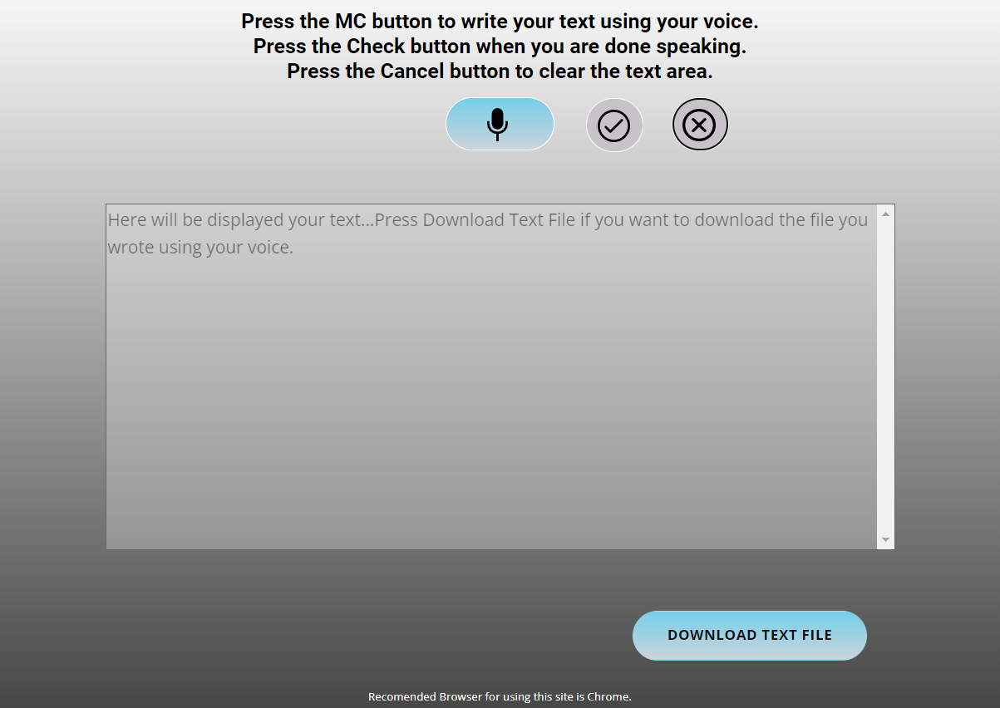
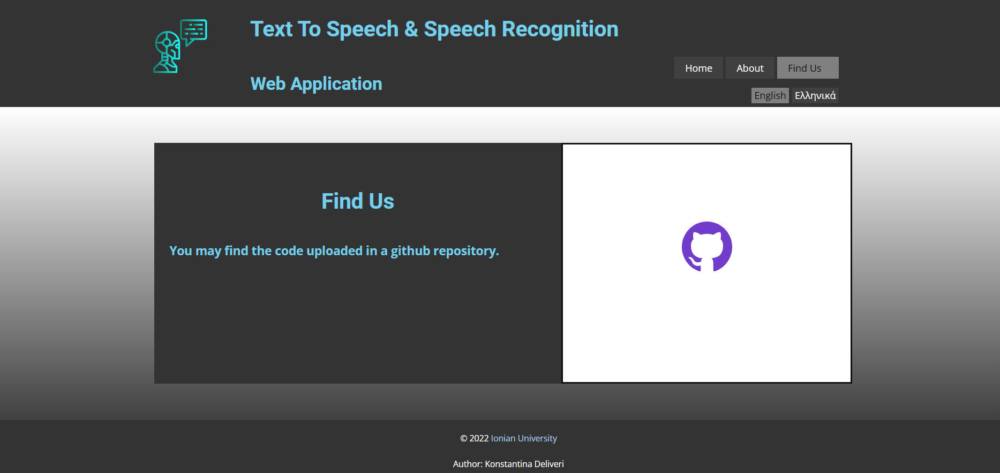

# Text-To-Speech and Speech Recognition Project

## Author: [Konstantina Deliveri](https://github.com/konstantinadeliveri)

#### A web application created using SpeechSynthesis() and SpeechRecognition() interfaces of the [Web Speech Api](https://developer.mozilla.org/en-US/docs/Web/API/Web_Speech_API), Nodejs, HTML and CSS code. The app offers two services: **text-to-speech** service where anyone can write a text file or upload a pdf file and the app recognizes and "speaks" whatever was written and the **speech-recognition** service where the user by pressing a button can speak and the app "listens" and displays the text in a text area where by pressing a button the user can download the text file. The app was uploaded on Github and deployed on Koyeb. [link](https://ttsnsprec-konstantinadeliveri.koyeb.app/)

#### Note: This web app was built for a university project and it supports only 2 languages(english & greek).

 
 
 
 
 

## Github Repository
Commented files. [Code](https://github.com/konstantinadeliveri/ttsnsprecproj/tree/main/public)

